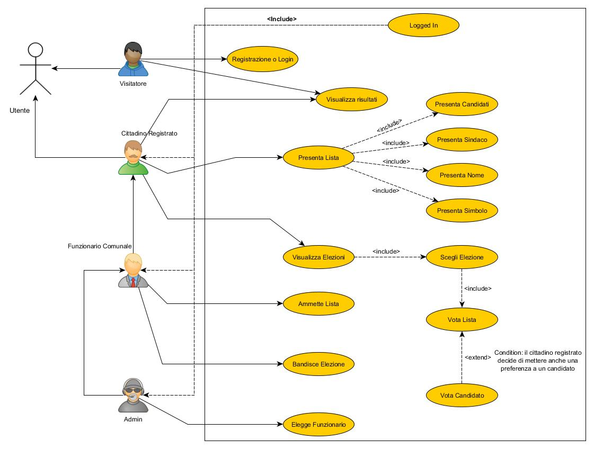
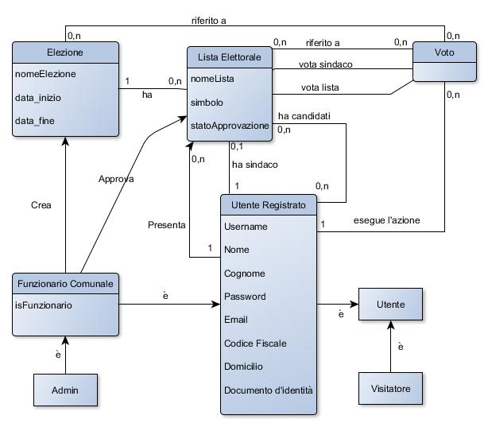

# Electronic vote system
***
A website that allows users to register and vote for candidates.

The administrator can create a new election and can view the list of users registered to the system, and by pressing the make official button he can make a registered user a municipal official.

If a municipal official is accessing the service: The municipal official can create a new election, and can also admit lists created by registered users of the service to the elections.

If a registered non-official user will access the service: A registered user can submit an electoral list (for a certain election) indicating the name of the candidate for Mayor, the components of the list, the name of the list and the symbol. Furthermore, he can vote, once he clicks on the Vote button the elections present in the system will be loaded with the relative start and end dates, the user can click on see the candidate lists for a specific election to access the lists of that election and can vote or the candidates of that list or the entire list. Finally, you will also be able to view the details of the completed elections

## Technologies
***
A list of technologies used within the project:
* [Java]()
* [GWT](http://www.gwtproject.org/)
* [JUnit]()
* [MapDB](https://mapdb.org/)
* [Eclipse](https://www.eclipse.org/ide/)
* [Trello](https://trello.com/it)
* [Jira](https://www.atlassian.com/it/software/jira)

***

Use Case Diagram:

Domain model:

